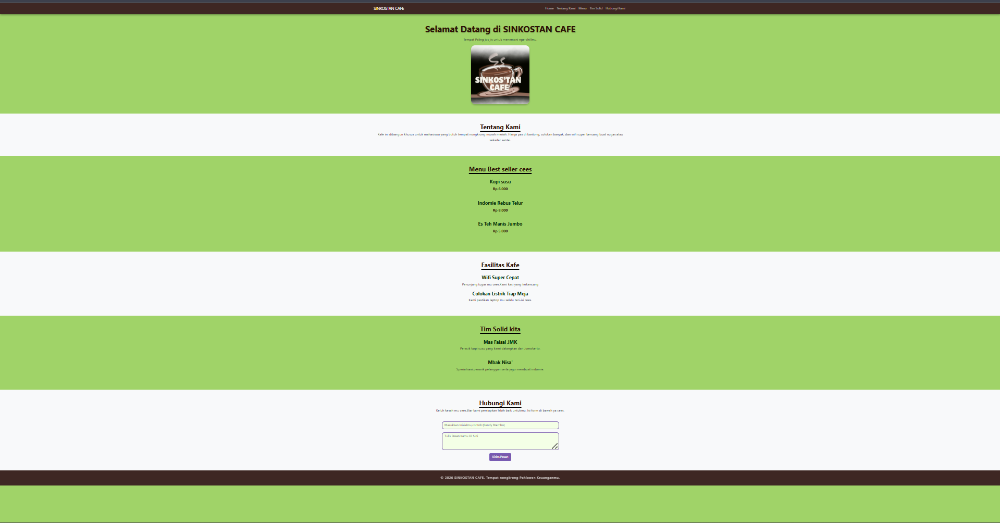

# UTS Pemrograman Web - SINKOSTAN CAFE

**Nama:** Fatir Awaluddin Putra
**NIM:** 3012410027
**Kelas:** IF-4A

## Deskripsi Project
SINKOSTAN CAFE adalah website berjenis *Company Profile* yang dirancang khusus sebagai bentuk transformasi digital dari kedai kopi konvensional. Website ini dibuat untuk memberikan informasi seputar menu, fasilitas, serta sarana komunikasi interaktif bagi para mahasiswa yang mencari tempat *nongkrong* ramah di kantong.

## Referensi Desain
Desain website ini terinspirasi dari beberapa referensi berikut:
- **Konsep Tampilan:** Modifikasi desain *clean & nature-friendly* menggunakan palet warna hijau (#a0d368) dan aksen coklat kopi.
- **Referensi:** Disesuaikan dari berbagai eksplorasi tata letak landing page minimalis di Pinterest serta dokumentasi resmi komponen Bootstrap 5.3. 

## Manipulasi DOM yang Diterapkan
Pada project ini, saya menerapkan beberapa manipulasi DOM menggunakan JavaScript murni (Vanilla JS), yaitu:
1. **Validasi Form:** Mencegah form kosong dikirim dengan menggunakan method `.trim()`.
2. **Menampilkan Elemen (Show/Hide):** Mengubah *style.display* dari `none` menjadi `block` untuk memunculkan notifikasi.
3. **Mengubah Isi Konten Secara Dinamis:** Memasukkan nilai input dari *user* ke dalam notifikasi menggunakan properti `.innerHTML` serta memanipulasi *class* Bootstrap (`alert-success` / `alert-danger`) berdasarkan kondisi input.

## Hasil Tampilan

---
*Project ini diselesaikan dengan lebih dari 30 tahap commit secara bertahap.*
